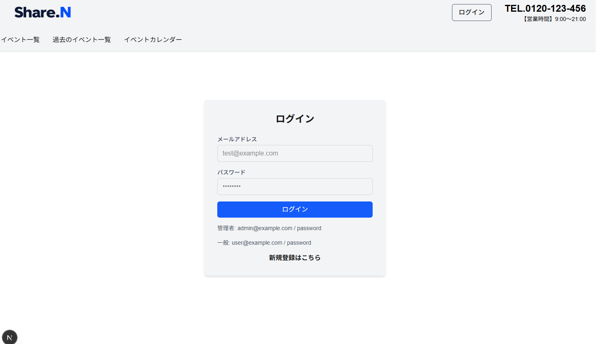

# Reservation-Management-System

## はじめに

### 開発目的

イベント予約・決済・管理機能を備えた予約管理システムを開発しました。
Next.js と Laravel を用いたフロントエンド・バックエンド分離構成を採用し、
REST API連携、認証機能、Stripe決済、MailPit認証など、
実務を意識したWebアプリケーション開発を目的として制作しました。

### 想定ユーザー

| ユーザー     | 機能                                                                                                                                                      | 認証必須 | memo                                                   |
| ------------ | --------------------------------------------------------------------------------------------------------------------------------------------------------- | :------: | ------------------------------------------------------ |
| 共通         | ログイン、ログアウト、新規登録、メール認証                                                                                                                |    ◯     | 管理者の場合はDBにて直接is_manager=1に設定する必要あり |
| 管理者       | 予約一覧表示/検索(全ユーザー予約)、イベント毎の予約一覧、決済ステータス変更（未払い時のみ）、お問合せ一覧表示(全ユーザーお問合せ)、お問合せ詳細表示       |    ◯     |                                                        |
| 一般ユーザー | 予約一覧表示/検索(自身の予約のみ)、予約キャンセル、予約詳細表示 、お問合せ一覧表示、お問合せ詳細表示、お問合せ新規作成/送信、お問合せ削除（未対応時のみ） |    ◯     |                                                        |
| 全ユーザー   | イベント一覧表示、イベントカレンダー表示、イベント詳細                                                                                                    |          |                                                        |

## Dockerビルド

- `git clone git@github.com:Nakama624/reservation-management-system.git`
- `cd reservation-management-system`
- `./vendor/bin/sail up -d`

## バックエンド環境構築

- `docker-compose exec php bash`
- `composer install`
- `cp .env.example .env`、環境変数を変更
- `sail artisan key:generate`
- `sail artisan migrate`
- `sail artisan db:seed`
- `sail artisan storage:link`

## フロントエンド環境構築

- `./vendor/bin/sail npm install`
- `cd frontend`
- `npm install`
- `npm run dev`

## mailhog

### 環境設定

http://localhost:8025/

> `.env` ファイルを以下のように修正。
>
> ```diff
> -　MAIL_FROM_ADDRESS=null
> +　MAIL_FROM_ADDRESS=no-reply@example.com
> ```

## stripe決済

### 環境設定

> stripe決済のアカウントを作成し、`.env` ファイルに以下のように追加。
> https://dashboard.stripe.com/login?locale=ja-JP
>
> ```diff
> +　STRIPE_SECRET=（stripe決済各ユーザーアカウントのシークレットキー）
> +　APP_URL=http://localhost
> ```

### 実行テスト１/クレジットカード（VISA/成功）

- メールアドレス：任意のアドレス
- カード番号(VISA)：4242424242424242
- MM/YY：（任意の将来の日付）
- セキュリティコード：（任意の 3 桁の数字）
- 名前：任意の名前

### 実行テスト２/コンビニ支払い（振込結果は非同期）

- メールアドレス：任意のアドレス
- 名前：任意の名前

### テスト詳細

- https://docs.stripe.com/testing

## 単体テスト

### DBを作成

- `docker-compose exec mysql bash`
- `mysql -u root -p`、パスワード入力
- `CREATE DATABASE demo_test;`
- `exit`

### .env.testingを作成

- `docker-compose exec php bash`
- `cp .env .env.testing`、環境変数を変更
- `php artisan key:generate --env=testing`
- `php artisan migrate --env=testing`

### テスト実行

- 1.ｘｘｘｘ：
  `ｘｘｘｘ`
- 2.ｘｘｘｘ：
  `ｘｘｘｘ`
- 3.ｘｘｘｘ：
  `ｘｘｘｘ`
- 4.ｘｘｘｘ：
  `ｘｘｘｘｘ`

## 使用技術

### フロントエンド

- Next.js：next@16.2.6
- React：react@19.2.4
- TypeScript：Version 5.9.3

### バックエンド

- PHP：PHP 8.4.13
- Laravel：Laravel Framework 10.50.2
- Laravel Sanctum：ｖ3.3.3

### データベース

- MySQL：mysql Ver 8.4.9 for Linux on x86_64

### その他

- Tailwind CSS：tailwindcss@4.2.4
- GitHub：git version 2.43.0
- stripe決済
- MailPit
- ES Lint

## ER図



## テーブル仕様

### users テーブル

| カラム名          | 型           | primary key | unique key | not null | foreign key |
| ----------------- | ------------ | ----------- | ---------- | -------- | ----------- |
| id                | bigint       | ◯           |            | ◯        |             |
| name              | varchar(255) |             |            | ◯        |             |
| email             | varchar(255) |             | ◯          | ◯        |             |
| password          | varchar(255) |             |            | ◯        |             |
| is_manager        | tinyint(1)   |             |            |          |             |
| email_verified_at | timestamp    |             |            |          |             |
| created_at        | timestamp    |             |            |          |             |
| updated_at        | timestamp    |             |            |          |             |

### events テーブル

| カラム名           | 型           | primary key | unique key | not null | foreign key |
| ------------------ | ------------ | ----------- | ---------- | -------- | ----------- |
| id                 | bigint       | ◯           |            | ◯        |             |
| title              | varchar(255) |             |            | ◯        |             |
| capacity           | bigint       |             |            | ◯        |             |
| lesson_img1        | varchar(255) |             |            | ◯        |             |
| lesson_img2        | varchar(255) |             |            |          |             |
| lesson_img3        | varchar(255) |             |            |          |             |
| catch_copy         | varchar(255) |             |            | ◯        |             |
| instructor_name    | varchar(255) |             |            | ◯        |             |
| instructor_img     | varchar(255) |             |            |          |             |
| instructor_profile | text         |             |            |          |             |
| price              | unsigned int |             |            | ◯        |             |
| created_at         | timestamp    |             |            |          |             |
| updated_at         | timestamp    |             |            |          |             |

### schedulesテーブル

| カラム名   | 型        | primary key | unique key | not null | foreign key |
| ---------- | --------- | ----------- | ---------- | -------- | ----------- |
| id         | bigint    | ◯           |            | ◯        |             |
| event_id   | bigint    |             |            | ◯        | event(id)   |
| start_at   | datetime  |             |            | ◯        |             |
| finish_at  | datetime  |             |            | ◯        |             |
| created_at | timestamp |             |            |          |             |
| updated_at | timestamp |             |            |          |             |

### reservationsテーブル

| カラム名           | 型           | primary key | unique key | not null | foreign key         |
| ------------------ | ------------ | ----------- | ---------- | -------- | ------------------- |
| id                 | bigint       | ◯           |            | ◯        |                     |
| user_id            | bigint       |             |            | ◯        | user(id)            |
| schedule_id        | bigint       |             |            | ◯        | schedule(id)        |
| contact_number     | varchar(255) |             |            | ◯        |                     |
| participants       | unsigned int |             |            | ◯        |                     |
| amount             | unsigned int |             |            | ◯        |                     |
| payment_status     | varchar(255) |             |            | ◯        |                     |
| payment_methods_id | bigint       |             |            | ◯        | payment_methods(id) |
| payment_updated_by | bigint       |             |            |          | user(id)            |
| paid_at            | datetime     |             |            |          |                     |
| created_at         | timestamp    |             |            |          |                     |
| updated_at         | timestamp    |             |            |          |                     |

### payment_methodsテーブル

| カラム名       | 型           | primary key | unique key | not null | foreign key |
| -------------- | ------------ | ----------- | ---------- | -------- | ----------- |
| id             | bigint       | ◯           |            | ◯        |             |
| payment_method | varchar(255) |             |            | ◯        |             |
| created_at     | timestamp    |             |            |          |             |
| updated_at     | timestamp    |             |            |          |             |

### contact_statusesテーブル

| カラム名   | 型           | primary key | unique key | not null | foreign key |
| ---------- | ------------ | ----------- | ---------- | -------- | ----------- |
| id         | bigint       | ◯           |            | ◯        |             |
| status     | varchar(255) |             |            | ◯        |             |
| created_at | timestamp    |             |            |          |             |
| updated_at | timestamp    |             |            |          |             |

## URL

- ログイン：http://localhost:3000/login
- phpMyAdmin：http://localhost:8080/
- MailPit：http://localhost:8025/
