# Reservation-Management-System

## はじめに

本システムは、イベントの予約・決済・管理を一元的に行うことができる予約管理システムです。ユーザーはイベントの検索・予約・決済を行うことができ、管理者はイベント情報や予約状況を管理できます。

開発にあたっては、フロントエンドに Next.js、バックエンドに Laravel を使用し、フロントエンドとバックエンドを分離した形で構築しました。双方はAPI連携しており、実際の業務システム開発を意識しております。

主な機能として、ユーザー認証機能、イベント予約機能、Stripe決済機能、メール認証機能、予約情報管理機能を実装しています。また、開発環境には MailPit を導入し、メール送信機能の検証を行えるようにしました。

本システムの開発を通じて、API設計・実装、認証処理、決済サービス連携、メール認証機能の実装、フロントエンドとバックエンドの連携など、実務を想定したWebアプリケーション開発スキルの習得を目的としました。

## 環境構築

### Dockerビルド

```bash
# リポジトリをクローン
git clone git@github.com:Nakama624/event-reservation-system.git

# プロジェクトディレクトリへ移動
cd event-reservation-system/laravel-next-app

# Composer パッケージをインストール
docker run --rm \
  -u "$(id -u):$(id -g)" \
  -v "$(pwd):/var/www/html" \
  -w /var/www/html \
  -e COMPOSER_CACHE_DIR=/tmp/composer_cache \
  laravelsail/php84-composer:latest \
  composer install

# Sail を起動
./vendor/bin/sail up -d
```

### バックエンド(laravel-next-app)

```bash
# Composer パッケージをインストール
./vendor/bin/sail composer install

# 環境変数ファイルを作成
cp .env.example .env

# .env を編集
# DB_PASSWORD と STRIPE_SECRET を設定

# アプリケーションキーを生成
./vendor/bin/sail artisan key:generate

# マイグレーションを実行
./vendor/bin/sail artisan migrate

# シーダーを実行
./vendor/bin/sail artisan db:seed

# ストレージリンクを作成
./vendor/bin/sail artisan storage:link
```

### MailPit

MailPit：http://localhost:8025/

> `laravel-next-app/.env` でMAIL_FROM_ADDRESSが設定されているか確認。
>
> ```diff
> -　MAIL_FROM_ADDRESS=null
> +　MAIL_FROM_ADDRESS=(例)no-reply@example.com
> ```

### stripe決済

公式テスト詳細：https://docs.stripe.com/testing

> stripe決済のアカウントを作成し、`laravel-next-app/.env` に以下のように追加。

>
> ```diff
> +　STRIPE_SECRET=（stripe決済各ユーザーアカウントのシークレットキー）
> ```

#### 実行/クレジットカード（VISA/成功）

- メールアドレス：任意のアドレス
- カード番号(VISA)：4242424242424242
- MM/YY：（任意の将来の日付）
- セキュリティコード：（任意の 3 桁の数字）
- 名前：任意の名前


### フロントエンド(next-frontend-app)

```bash
# フロントエンドディレクトリへ移動
cd ../next-frontend-app/

# パッケージをインストール
npm install

# 環境変数ファイルを作成
cp .env.example .env.local

# .env.local を編集
# NEXTAUTH_SECRET にランダムな文字列を設定

# 開発サーバーを起動
npm run dev
```


## URL

- ログイン：http://localhost:3000/login
- phpMyAdmin：http://localhost:8080/
- MailPit：http://localhost:8025/

## バックエンドテスト実行

### DBを作成

```bash
# Laravel プロジェクトディレクトリへ移動
cd laravel-next-app

# MySQL コンテナへ接続
./vendor/bin/sail exec mysql bash

# MySQL にログイン
mysql -u root -p

# パスワードを入力

# テスト用データベースを作成
CREATE DATABASE demo_test;

# MySQL を終了
exit

# コンテナを終了
exit
```

### .env.testingを作成

```bash
# テスト環境用の環境変数ファイルを作成
cp .env .env.testing

# テスト環境用のアプリケーションキーを生成
./vendor/bin/sail artisan key:generate --env=testing

# テスト環境用のマイグレーションを実行
./vendor/bin/sail artisan migrate --env=testing
```

### Laravel/Unitテスト実行

```bash
# Laravel プロジェクトディレクトリへ移動
cd laravel-next-app

# テストを一括実行
./vendor/bin/sail artisan test
```

- 1.ログイン機能
  | ファイル名 | テスト内容 |
  | ----------------------- | --------------------------------------------------------- |
  | `Feature/LoginTest.php` | ログインできる 　　　 |
  | | ログイン失敗できる |
  | | 会員登録できる 　　　　　　　　　　　　　　　　　　　　　 |
  | | 認証済みユーザー情報を取得できる 　　　　　 |
  | | ログアウトできる 　　　　　　　　　　 |
  | | 未ログインでは /api/user にアクセスできない |

- 2.予約機能
  | ファイル名 | テスト内容 |
  | ----------------------------- | ------------------------------------------------------------------------- |
  | `Feature/ReservationTest.php` | ログインユーザーが予約できる 　　　 |
  | | 同じユーザーが同じイベントを二重予約できない |
  | | 残席数を超えて予約できない 　　　　　　　　　　　　　　　　　　　　　 |
  | | 自分の予約をキャンセルできる 　　　　　 |
  | | 自分の予約だけ取得できる 　　　　　　　　　　 |
  | | 他人の予約をキャンセルできない 　　　　　　　　　　　　　　　　　　　　　 |

- 3.イベント閲覧機能
  | ファイル名 | テスト内容 |
  | ----------------------- | ------------------------------------------------------------------------ |
  | `Feature/EventTest.php` | イベント一覧を取得できる 　　　 |
  | | 過去イベント一覧を取得できる |
  | | イベント詳細を取得できる 　　　　　　　　　　　　　　　　　　　　　 |
  | | キーワード検索でイベントを絞り込める 　　　　　　　　　　 |
  | | 日付検索でイベントを絞り込める　　　　　　　　　　　　　　　　　　　　　 |

- 4.お問合せ機能
  | ファイル名 | テスト内容 |
  | ------------------------- | ----------------------------------------------------------------------------- |
  | `Feature/ContactTest.php` | ログインユーザーがお問い合わせを作成できる 　　　 |
  | | 自分のお問い合わせ一覧を取得できる |
  | | 自分のお問い合わせ詳細を取得できる 　　　　　　　　　　　　　　　　　　　　　 |
  | | 他人のお問い合わせ詳細は見られない 　　　　　　　　　　 |
  | | お問い合わせを論理削除できる |
  | | 未ログインではお問い合わせできない |

- 5.管理者機能
  | ファイル名 | テスト内容 |
  | ----------------------- | ------------------------------------------------------------------------- |
  | `Feature/AdminTest.php` | 管理者は管理者用イベント一覧を取得できる 　　　 |
  | | 管理者はイベント詳細・予約者一覧を取得できる |
  | | 管理者は予約を入金済みにできる 　　　　　　　　　　　　　　　　　　　　　 |
  | | 管理者はお問い合わせ一覧を取得できる 　　　　　　　　　　 |
  | | 管理者はお問い合わせ詳細を取得できる |
  | | 一般ユーザーは管理者APIにアクセスできない |
  | | 未ログインでは管理者APIにアクセスできない |

## フロントエンドテスト実行

### Vitest実行

```bash
# フロントエンドテストを一括実行
npm test
```

```text
# テストファイル配置場所
next-frontend-app/src/tests/components/
```

| ファイル名             | テスト内容                                                |
| ---------------------- | --------------------------------------------------------- |
| `EventSearch.test.tsx` | 検索フォームが表示される                                  |
| `Header.test.tsx`      | ログイン中のユーザー名が表示される                        |
|                        | 一般ユーザーの場合、ロゴリンクは /reservation/list になる |
|                        | 管理者の場合、ロゴリンクは /admin/event/list になる       |
|                        | ログアウトボタンを押すとLaravel logout後にsignOutされる   |
|                        | 読み込み中はLoadingが表示される                           |
|                        | 一般ユーザーの場合、ロゴリンクは /reservation/list になる |
| `LinkButton.test.tsx`  | ボタンが表示される                                        |
|                        | 正しく遷移される                                          |
|                        | 読み込み中はLoadingが表示される                           |
| `Menu.test.tsx`        | イベント一覧が表示される                                  |
|                        | 一般ユーザーは予約一覧が表示される                        |
|                        | 管理者は全ての予約が表示される                            |

### playwright実行
```bash
# フロントエンドディレクトリへ移動
cd next-frontend-app

```bash
# フロントエンドディレクトリへ移動
cd next-frontend-app

# E2Eテストを一括実行
npm run test:e2e
```

```text
# テストファイル配置場所
next-frontend-app/tests/
```

- 認証系テスト

| ファイル名                 | テスト内容                                                         |
| -------------------------- | ------------------------------------------------------------------ |
| `auth/admin-login.spec.ts` | 正しい認証情報でログインできること                                 |
|                            | 間違った認証情報ではログインできないこと                           |
|                            | 未ログインで管理画面にアクセスするとログイン画面へ戻されること     |
| `auth/login.spec.ts`       | 正しい認証情報でログインできること                                 |
|                            | 間違った認証情報ではログインできないこと                           |
|                            | 未ログインで予約一覧画面にアクセスするとログイン画面へ戻されること |

- お問い合わせ機能テスト

| ファイル名                      | テスト内容                                               |
| ------------------------------- | -------------------------------------------------------- |
| `contact/admin-contact.spec.ts` | お問合せが一覧表示されていること                         |
|                                 | お問合せ内容（詳細）が表示されていること                 |
| `contact/contact-list.spec.ts`  | お問合せが一覧表示されていること                         |
|                                 | お問合せ一覧に自分が投稿したお問合せが表示されていること |

- お問い合わせ機能テスト

| ファイル名                      | テスト内容                                               |
| ------------------------------- | -------------------------------------------------------- |
| `contact/admin-contact.spec.ts` | お問合せが一覧表示されていること                         |
|                                 | お問合せ内容（詳細）が表示されていること                 |
| `contact/contact-list.spec.ts`  | お問合せが一覧表示されていること                         |
|                                 | お問合せ一覧に自分が投稿したお問合せが表示されていること |
| `contact/contact.spec.ts`       | お問合せ一覧から新規作成画面に遷移することができる       |
|                                 | 詳細が未入力の場合エラーメッセージが表示されること       |

- イベント閲覧機能テスト

| ファイル名                             | テスト内容                                                     |
| -------------------------------------- | -------------------------------------------------------------- |
| `event/admin-reservation-list.spec.ts` | 全ユーザー予約がイベント毎に一覧表示されている                 |
|                                        | お問合せ内容（詳細）が表示されていること                       |
| `event/event-list.spec.ts`             | イベント一覧が表示されること                                   |
|                                        | 講師名で検索すると部分一致で検索結果のみが表示されること       |
|                                        | 日付で検索すると開催日付が一致する検索結果のみが表示されること |

- イベント予約機能テスト

| ファイル名                             | テスト内容                                             |
| -------------------------------------- | ------------------------------------------------------ |
| `reservation/reservation-list.spec.ts` | 自分の予約一覧を確認できること                         |
|                                        | キャンセル済み予約が表示されること                     |
| `reservation/reservation.spec.ts`      | 支払方法が未選択の場合エラーメッセージが表示されること |
|                                        | 参加人数にあわせて合計金額が正しく計算されること       |
|                                        | 同じイベントを二重予約できないこと                     |

## 使用技術

### フロントエンド

- Next.js：next@16.2.6
- React：react@19.2.4
- TypeScript：Version 5.9.3
- Tailwind CSS：tailwindcss@4.3.0

### バックエンド

- PHP：PHP 8.4.13
- Laravel：Laravel Framework 13.9.0
- Laravel Sanctum： \* v4.3.2

### データベース

- MySQL：mysql Ver 8.4.9 for Linux on x86_64

### テスト

- Vitest：vitest/4.1.7
- Playwright：Version 1.60.0

### その他

- Git：git version 2.43.0
- stripe決済
- MailPit
- ES Lint

## 画面遷移図

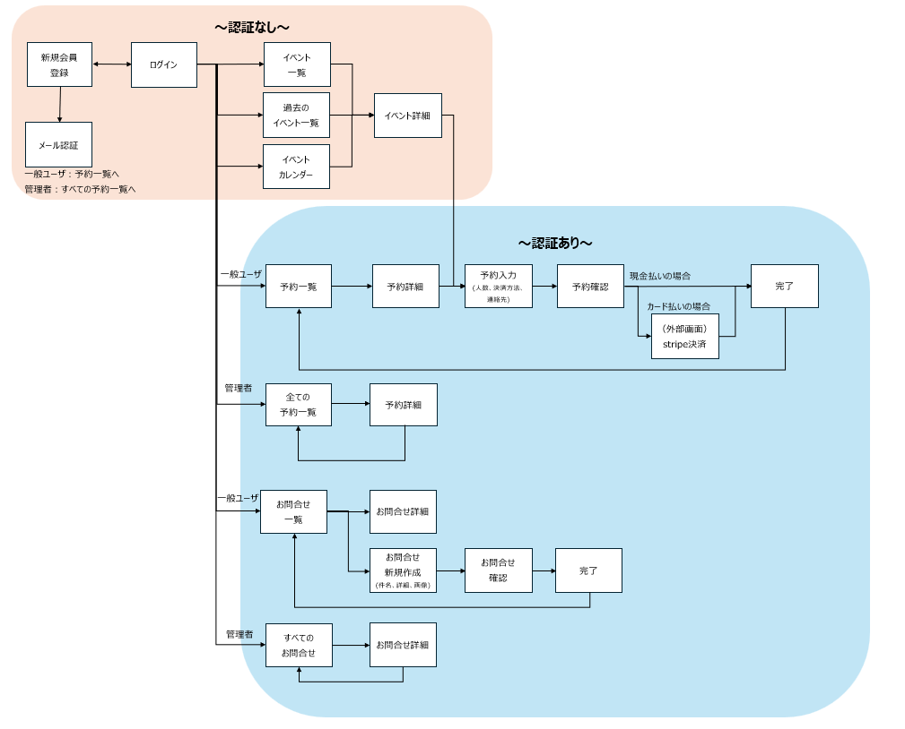

## ER図

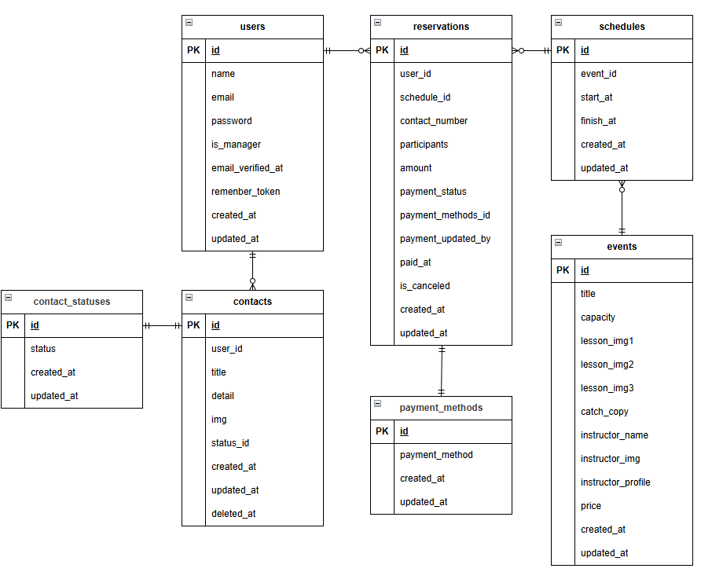

## テーブル仕様

### users テーブル

| カラム名          | 型           | primary key | unique key | not null | foreign key |
| ----------------- | ------------ | ----------- | ---------- | -------- | ----------- |
| id                | bigint       | ◯           |            | ◯        |             |
| name              | varchar(255) |             |            | ◯        |             |
| email             | varchar(255) |             | ◯          | ◯        |             |
| password          | varchar(255) |             |            | ◯        |             |
| is_manager        | tinyint(1)   |             |            |          |             |
| email_verified_at | timestamp    |             |            |          |             |
| remenber_token    | VARCHAR(100) |             |            |          |             |
| created_at        | timestamp    |             |            |          |             |
| updated_at        | timestamp    |             |            |          |             |

### events テーブル

| カラム名           | 型           | primary key | unique key | not null | foreign key |
| ------------------ | ------------ | ----------- | ---------- | -------- | ----------- |
| id                 | bigint       | ◯           |            | ◯        |             |
| title              | varchar(255) |             |            | ◯        |             |
| capacity           | bigint       |             |            | ◯        |             |
| lesson_img1        | varchar(255) |             |            | ◯        |             |
| lesson_img2        | varchar(255) |             |            |          |             |
| lesson_img3        | varchar(255) |             |            |          |             |
| catch_copy         | varchar(255) |             |            | ◯        |             |
| instructor_name    | varchar(255) |             |            | ◯        |             |
| instructor_img     | varchar(255) |             |            |          |             |
| instructor_profile | text         |             |            |          |             |
| price              | unsigned int |             |            | ◯        |             |
| created_at         | timestamp    |             |            |          |             |
| updated_at         | timestamp    |             |            |          |             |

### schedulesテーブル

| カラム名   | 型        | primary key | unique key | not null | foreign key |
| ---------- | --------- | ----------- | ---------- | -------- | ----------- |
| id         | bigint    | ◯           |            | ◯        |             |
| event_id   | bigint    |             |            | ◯        | event(id)   |
| start_at   | datetime  |             |            | ◯        |             |
| finish_at  | datetime  |             |            | ◯        |             |
| created_at | timestamp |             |            |          |             |
| updated_at | timestamp |             |            |          |             |

### reservationsテーブル

| カラム名           | 型           | primary key | unique key | not null | foreign key         |
| ------------------ | ------------ | ----------- | ---------- | -------- | ------------------- |
| id                 | bigint       | ◯           |            | ◯        |                     |
| user_id            | bigint       |             |            | ◯        | user(id)            |
| schedule_id        | bigint       |             |            | ◯        | schedule(id)        |
| contact_number     | varchar(255) |             |            | ◯        |                     |
| participants       | unsigned int |             |            | ◯        |                     |
| amount             | unsigned int |             |            | ◯        |                     |
| payment_status     | varchar(255) |             |            | ◯        |                     |
| payment_methods_id | bigint       |             |            | ◯        | payment_methods(id) |
| payment_updated_by | bigint       |             |            |          | user(id)            |
| paid_at            | datetime     |             |            |          |                     |
| is_canceled        | tinyint(1)   |             |            |          |                     |
| created_at         | timestamp    |             |            |          |                     |
| updated_at         | timestamp    |             |            |          |                     |

### contactsテーブル

| カラム名   | 型           | primary key | unique key | not null | foreign key        |
| ---------- | ------------ | ----------- | ---------- | -------- | ------------------ |
| id         | bigint       | ◯           |            | ◯        |                    |
| title      | varchar(255) |             |            | ◯        |                    |
| detail     | text         |             |            | ◯        |                    |
| img        | varchar(255) |             |            |          |                    |
| status_id  | bigint       |             |            | ◯        | contact_status(id) |
| created_at | timestamp    |             |            |          |                    |
| updated_at | timestamp    |             |            |          |                    |
| deleted_at | timestamp    |             |            |          |                    |

### payment_methodsテーブル

| カラム名       | 型           | primary key | unique key | not null | foreign key |
| -------------- | ------------ | ----------- | ---------- | -------- | ----------- |
| id             | bigint       | ◯           |            | ◯        |             |
| payment_method | varchar(255) |             |            | ◯        |             |
| created_at     | timestamp    |             |            |          |             |
| updated_at     | timestamp    |             |            |          |             |

### contact_statusesテーブル

| カラム名   | 型           | primary key | unique key | not null | foreign key |
| ---------- | ------------ | ----------- | ---------- | -------- | ----------- |
| id         | bigint       | ◯           |            | ◯        |             |
| status     | varchar(255) |             |            | ◯        |             |
| created_at | timestamp    |             |            |          |             |
| updated_at | timestamp    |             |            |          |             |

---

## 画面一覧・機能一覧

### 認証について

| 区分       | 説明                         |
| ---------- | ---------------------------- |
| 認証なし   | ログイン不要で利用可能       |
| 認証あり   | ログインユーザーのみ利用可能 |
| 管理者限定 | 管理者ユーザーのみ利用可能   |

---

## 一般ユーザー向け画面

### 1. ログイン画面

| 項目             | 内容                     |
| ---------------- | ------------------------ |
| URL              | `/login`                 |
| 認証             | なし                     |
| 想定利用ユーザー | 一般ユーザー / 管理者    |
| 機能             | ログイン認証             |
|                  | 入力バリデーション       |
|                  | ログイン成功時の画面遷移 |

## 

---

### 2. 新規会員登録画面

| 項目             | 内容               |
| ---------------- | ------------------ |
| URL              | `/register`        |
| 認証             | なし               |
| 想定利用ユーザー | 一般ユーザー       |
| 機能             | 新規ユーザー登録   |
|                  | 入力バリデーション |
|                  | アカウント作成     |

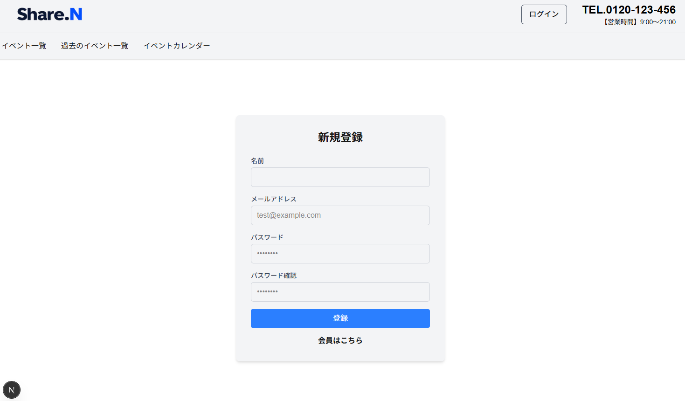

---

### 3. メール認証画面

| 項目             | 内容                        |
| ---------------- | --------------------------- |
| URL              | `/email/verify/{id}/{hash}` |
| 認証             | なし                        |
| 想定利用ユーザー | 一般ユーザー                |
| 機能             | mailpitへ遷移               |
|                  | メール再送槙                |

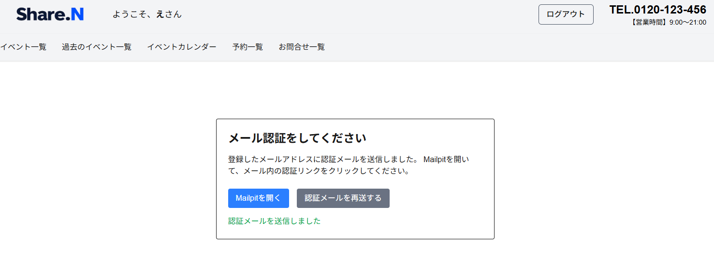

---

### 4. イベント一覧画面

| 項目             | 内容                               |
| ---------------- | ---------------------------------- |
| URL              | `/event/list`                      |
| 認証             | なし                               |
| 想定利用ユーザー | 一般ユーザー / 管理者              |
| 機能             | イベント一覧表示                   |
|                  | ページネーション                   |
|                  | キーワード検索(講師名、イベント名) |
|                  | 開催日付検索                       |

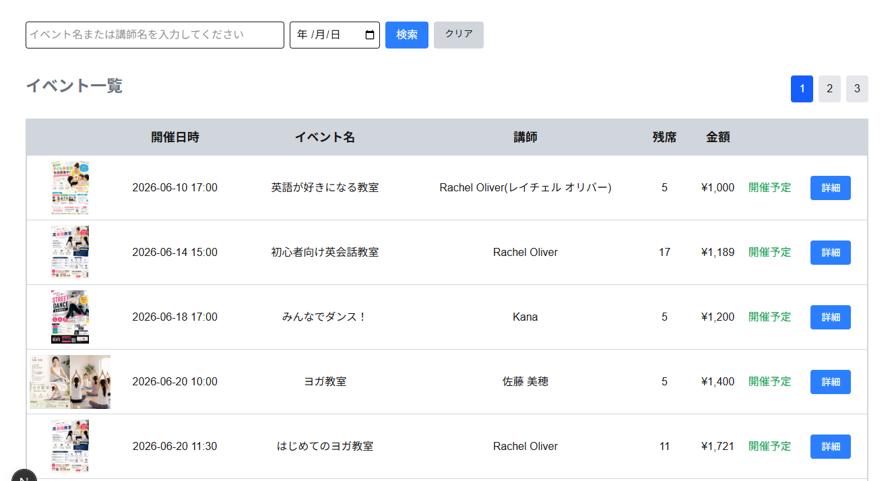

---

### 5. 過去のイベント一覧画面

| 項目             | 内容                               |
| ---------------- | ---------------------------------- |
| URL              | `/past-event/list`                 |
| 認証             | なし                               |
| 想定利用ユーザー | 一般ユーザー / 管理者              |
| 機能             | イベント一覧表示                   |
|                  | ページネーション                   |
|                  | キーワード検索(講師名、イベント名) |
|                  | 開催日付検索                       |

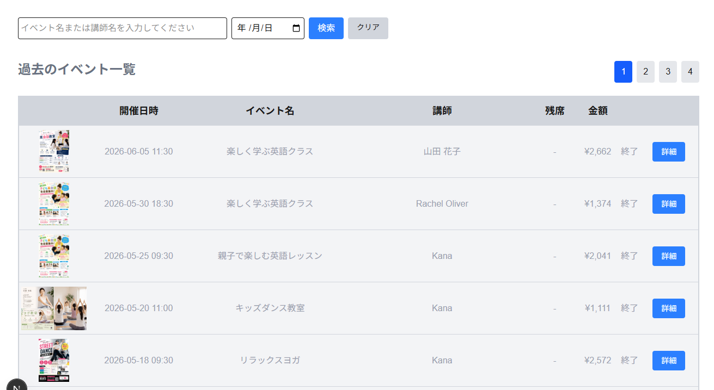

---

### 6. イベント詳細画面

| 項目             | 内容                  |
| ---------------- | --------------------- |
| URL              | `/event/[id]`         |
| 認証             | なし                  |
| 想定利用ユーザー | 一般ユーザー / 管理者 |
| 機能             | イベント詳細表示      |
|                  | 開催日時表示          |
|                  | 定員表示              |
|                  | 予約画面への導線      |

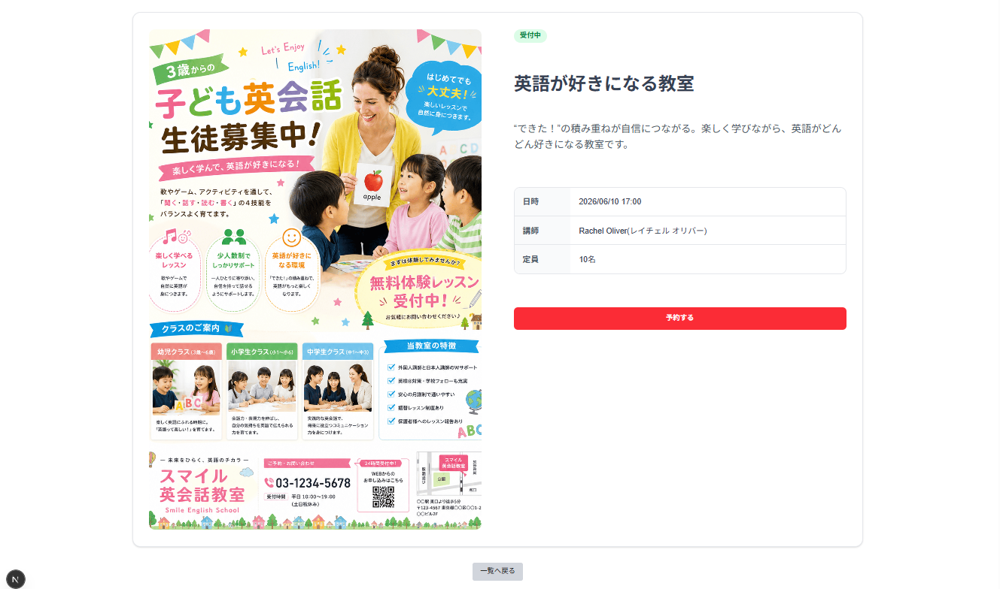

---

### 7. イベントカレンダー画面

| 項目             | 内容                     |
| ---------------- | ------------------------ |
| URL              | `/calendar`              |
| 認証             | なし                     |
| 想定利用ユーザー | 一般ユーザー / 管理者    |
| 機能             | イベント詳細表示         |
|                  | 開催日時表示             |
|                  | イベント詳細画面への導線 |

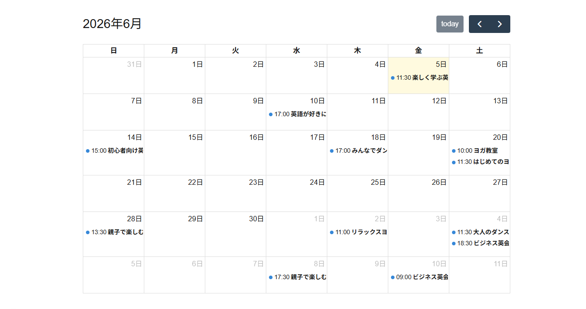

---

### 8. 予約入力画面

| 項目             | 内容                      |
| ---------------- | ------------------------- |
| URL              | `/event/{id}/reservation` |
| 認証             | あり                      |
| 想定利用ユーザー | 一般ユーザー              |
| 機能             | 人数入力                  |
|                  | 決済方法選択              |

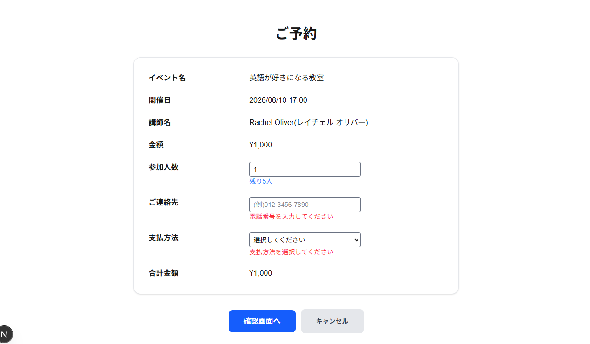

---

### 9. 予約確認画面

| 項目             | 内容                              |
| ---------------- | --------------------------------- |
| URL              | `/event/[id]/reservation/confirm` |
| 認証             | あり                              |
| 想定利用ユーザー | 一般ユーザー                      |
| 機能             | 予約内容確認                      |
|                  | 二重送信防止                      |

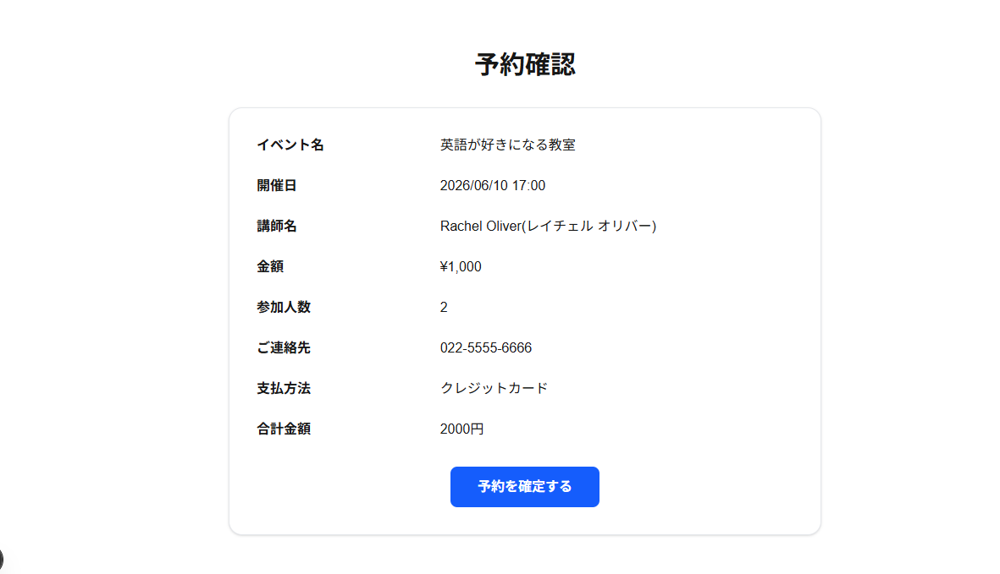

---

### 10. Stripe決済画面(外部画面)

| 項目             | 内容                 |
| ---------------- | -------------------- |
| URL              | Stripe Checkout      |
| 認証             | あり                 |
| 想定利用ユーザー | 一般ユーザー         |
| 機能             | クレジットカード決済 |
|                  | 決済実行             |
|                  | 決済完了画面への遷移 |

---

### 11. 予約完了画面

| 項目             | 内容                                      |
| ---------------- | ----------------------------------------- |
| URL              | `/event/[id]/reservation/payment-success` |
| 認証             | あり                                      |
| 想定利用ユーザー | 一般ユーザー                              |
| 機能             | 予約完了メッセージ表示                    |

## 

### 12. 予約一覧画面（各個人）

| 項目             | 内容                               |
| ---------------- | ---------------------------------- |
| URL              | `/reservation/list`                |
| 認証             | あり                               |
| 想定利用ユーザー | 一般ユーザー                       |
| 機能             | 自分の予約一覧表示                 |
|                  | 予約キャンセル                     |
|                  | キーワード検索(講師名、イベント名) |
|                  | 開催日付検索                       |

## 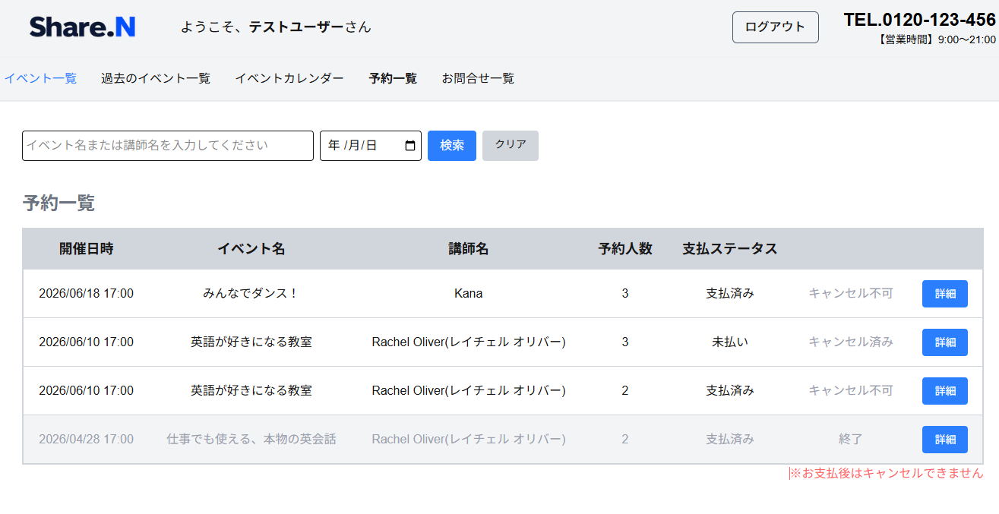

---

### 13. 予約詳細画面

| 項目             | 内容                |
| ---------------- | ------------------- |
| URL              | `/reservation/{id}` |
| 認証             | あり                |
| 想定利用ユーザー | 一般ユーザー        |
| 機能             | 予約情報確認        |

---

### 14. お問合せ一覧画面

| 項目             | 内容               |
| ---------------- | ------------------ |
| URL              | `/contact/list`    |
| 認証             | あり               |
| 想定利用ユーザー | 一般ユーザー       |
| 機能             | お問合せ一覧表示   |
|                  | お問合せ削除(論理) |

## 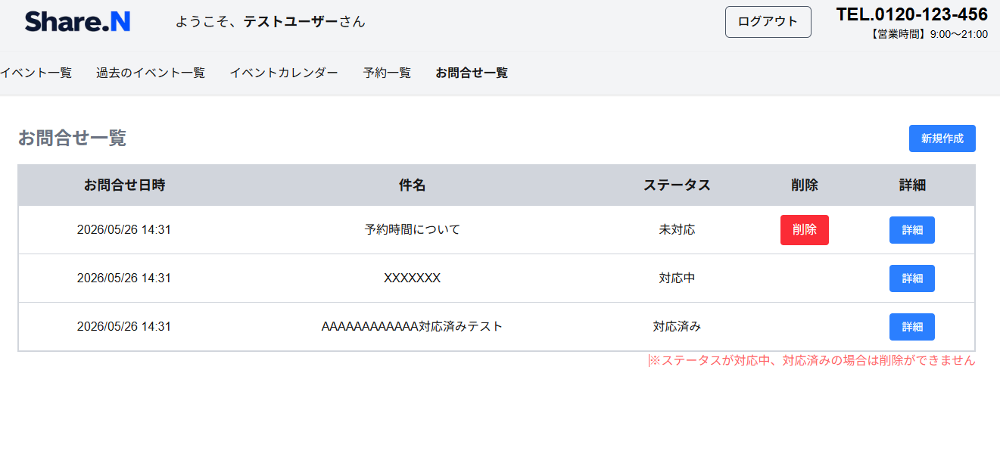

---

### 15. お問合せ新規画面

| 項目             | 内容               |
| ---------------- | ------------------ |
| URL              | `/contact`         |
| 認証             | なし               |
| 想定利用ユーザー | 一般ユーザー       |
| 機能             | お問合せ入力       |
|                  | 入力バリデーション |

## 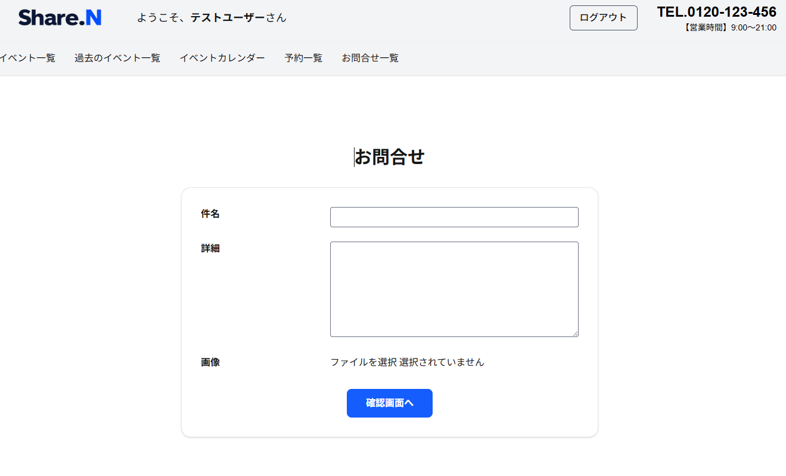

---

### 16. お問合せ確認画面

| 項目             | 内容               |
| ---------------- | ------------------ |
| URL              | `/contact/confirm` |
| 認証             | なし               |
| 想定利用ユーザー | 一般ユーザー       |
| 機能             | お問合せ内容確認   |
|                  | お問合せ送信       |

## 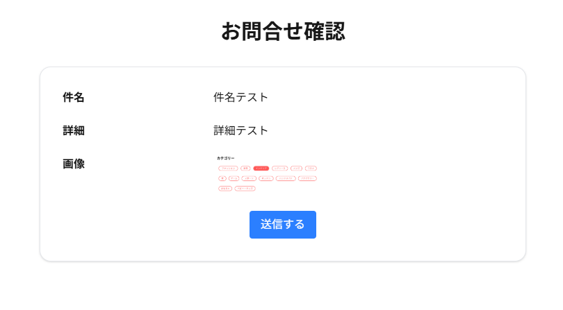

---

### 17. お問合せ完了画面

| 項目             | 内容                       |
| ---------------- | -------------------------- |
| URL              | `/contact/complete`        |
| 認証             | あり                       |
| 想定利用ユーザー | 一般ユーザー               |
| 機能             | お問合せ完了メッセージ表示 |

## 

---

### 18. お問合せ詳細画面

| 項目             | 内容             |
| ---------------- | ---------------- |
| URL              | `/contact/[id]`  |
| 認証             | あり             |
| 想定利用ユーザー | 一般ユーザー     |
| 機能             | お問合せ内容表示 |

## 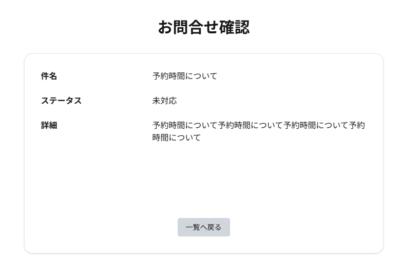

---

## 管理者向け画面

### 19. 予約一覧管理画面

| 項目             | 内容                |
| ---------------- | ------------------- |
| URL              | `/admin/event/list` |
| 認証             | 管理者限定          |
| 想定利用ユーザー | 管理者              |
| 機能             | 全予約一覧表示      |
|                  | 予約状況確認        |
|                  | 参加人数確認        |

## 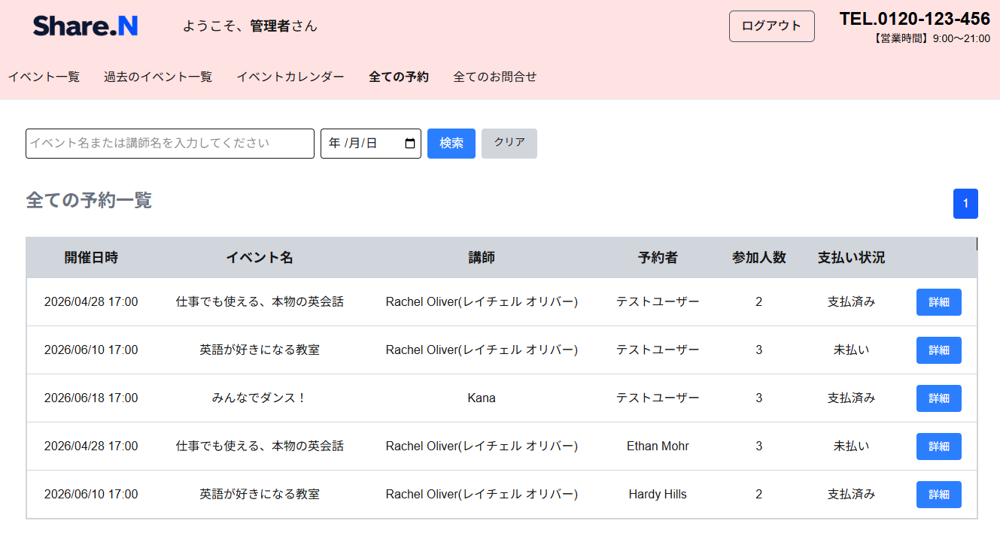

---

### 20. 予約詳細管理画面

| 項目             | 内容                |
| ---------------- | ------------------- |
| URL              | `/admin/event/[id]` |
| 認証             | 管理者限定          |
| 想定利用ユーザー | 管理者              |
| 機能             | 全予約一覧表示      |
|                  | 予約状況確認        |
|                  | 参加人数確認        |
|                  | 決済ステータス変更  |

## 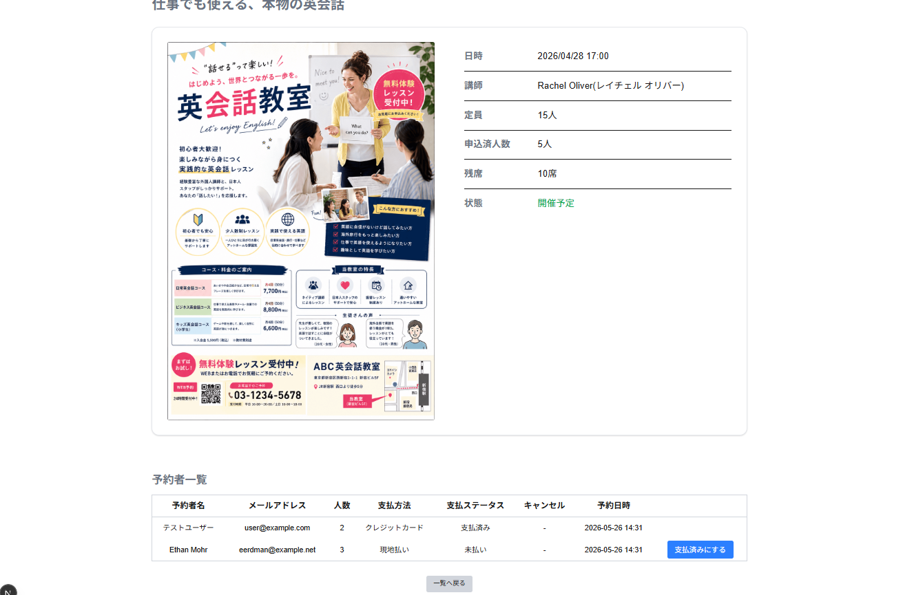

---

### 21. お問合せ一覧画面

| 項目             | 内容                  |
| ---------------- | --------------------- |
| URL              | `/admin/contact/list` |
| 認証             | 管理者限定            |
| 想定利用ユーザー | 管理者                |
| 機能             | お問合せ一覧表示      |

## 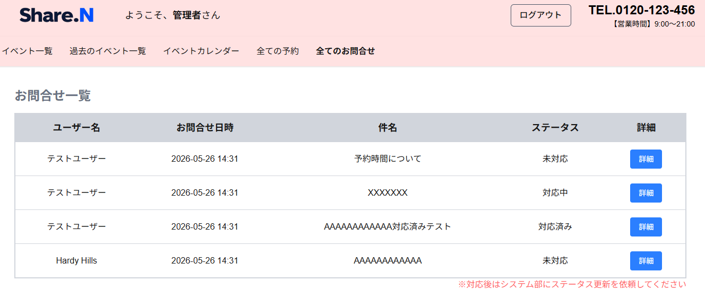

---

### 22. お問合せ詳細画面

| 項目             | 内容                  |
| ---------------- | --------------------- |
| URL              | `/admin/contact/[id]` |
| 認証             | 管理者限定            |
| 想定利用ユーザー | 管理者                |
| 機能             | お問合せ詳細確認      |

## 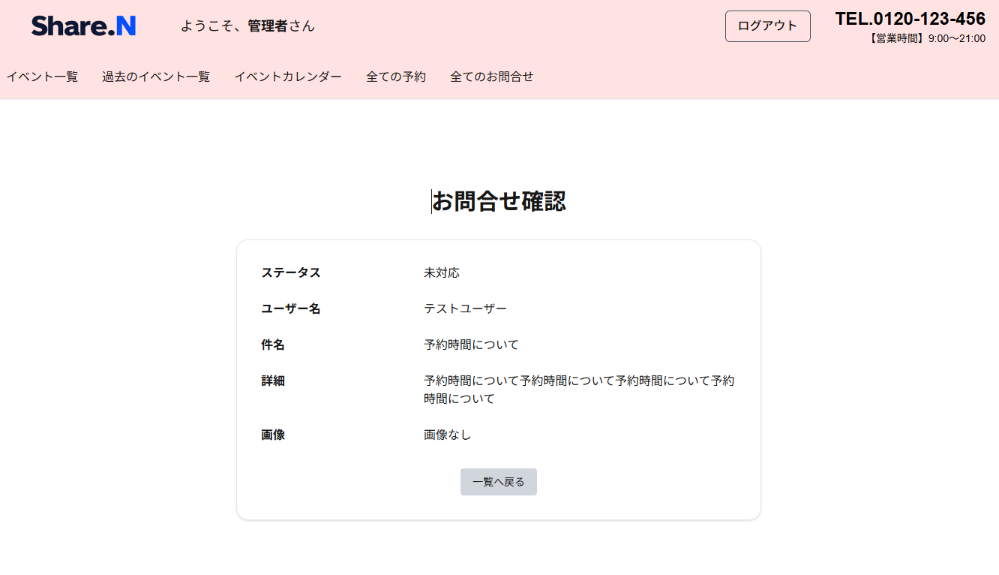

## おわりに

本システムの開発を通して、LaravelとNext.jsを用いたフロントエンド・バックエンド分離構成の開発を経験し、API設計や認証機能、決済機能、テストコード実装など幅広い技術に触れることができました。

特に、Stripeを利用した決済機能やメール認証機能の実装では、外部サービスとの連携方法について学ぶことができました。また、PlaywrightやPHPUnitを用いたテスト実装を行うことで、品質を担保しながら開発を進める重要性を実感しました。

今後はユーザー目線での操作性や運用面での課題解決を意識しながら、実際の業務システムを想定した機能改善や機能追加を継続して行い、より完成度の高いシステムへ発展させていきたいと考えています。
